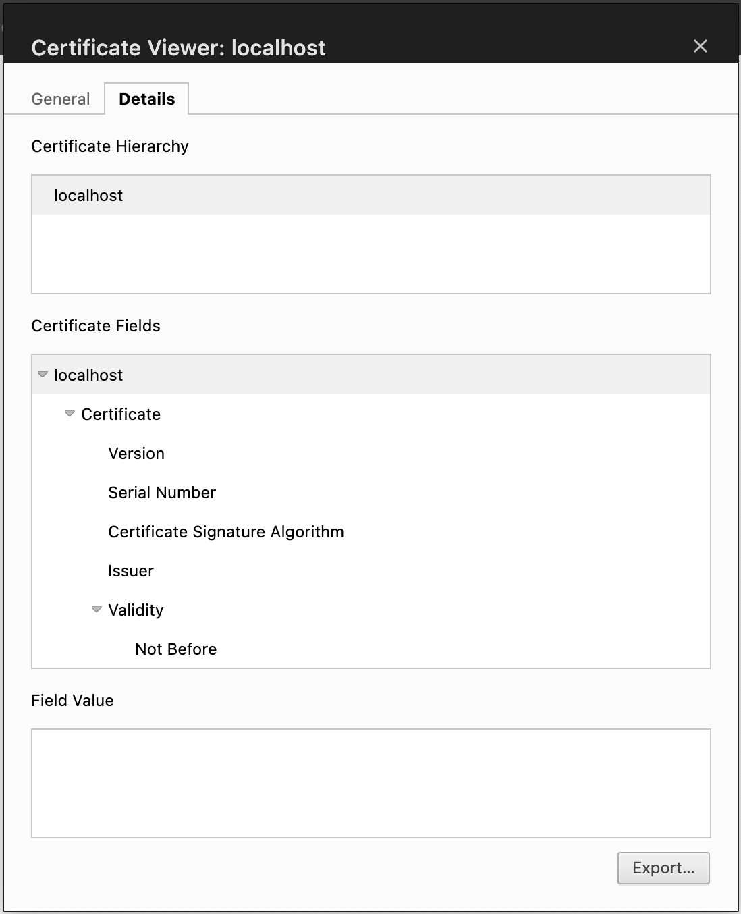

# Getting started

## Prerequisites
- Cloud Pak for AIOps cluster
- Node.js v18
- OpenShift CLI (oc)

## Step-by-step
1. Fork this repository.

2. Install dependencies.

    `npm i`

3. Create an API key.
  - If you're using a shared account, check with the account owner for an existing key.
  - Otherwise, create an API key here - https://cpd-\<project-name\>.apps.\<cluster-name\>.\<domain\>/zen/#/settings/profile/list, e.g.
    > https://cpd-aiops.apps.yourcluster.cp.yourdomain.com/zen/#/settings/profile/list

4. Enable the dashboard extension feature on your cluster.
  - `oc login --token=<admin user token> --server=<your cluster>`
  - `oc patch aiopsui aiopsui-instance --type merge -p '{"spec":{"container":{"uiBundleApi":{"image":{"pullSecret":"YOUR PULL SECRET"}}}}}' -n <AIOps namespace>`
  - `npm run enable -- -n <AIOps namespace>`

5. Update the user name and API key in `target.json` with the key from the previous step. This is used to test with your cluster. Your resulting file should read like:
```json
  {
    "url": "https://cpd-aiops.apps.yourcluster.cp.yourdomain.com/",
    "username": "<your api user>",
    "apiKey": "<your api key>",
    "tenantId": "cfd95b7e-3bc7-4006-a4a8-a73a79c71255",
    "bundleName": "alerts-examples"
  }
```

6. Run the examples within your Cloud Pak for AIOps cluster.
  - Deploy the examples to the cluster, `npm run deploy -- -n <AIOps namespace>`
  - Confirm the examples show up in the main menu at your browser console (e.g. https://cpd-aiops.apps.yourcluster.cp.yourdomain.com).
  > You may need to wait a minute then reload the browser console to pick up the changes.
  > Also if you ever want to remove the examples, `npm run examples -- --remove -n <AIOps namespace>`

7. Run the examples locally.
  - Start your local server, `npm start`
  > Make sure there are no other processes running on port 8080.
  - Open a browser to your dashboard page. The format is

    `https://127.0.0.1:8080/aiops/cfd95b7e-3bc7-4006-a4a8-a73a79c71255/page/alerts-workflow`
  > alerts-workflow is one of the example pages provided. Other examples include alerts-timeline and alerts-top-10.

8. Build your own custom pages!
  - Predefined panels - Use a panel provided by Cloud Pak for AIOps, alertViewer or incidentViewer.
  - Custom panels - Create custom React components to do whatever you like. Several examples are provided to help get you started.
  > All panels must be exported in `src/index.js`.

9. Use the example config `config/routes.json` as a starting point and add your own routes and panels, following the [schema](config/schemas/routes.json).
  - Set the path by which the custom dashboard page will be accessible from the console URL, e.g. `/your-path`.
  - Define how your panels are organized in the page. Regions include top, bottom, left and right.
  - Whenever you want to see the changes in your cluster you will have to re-run the ```npm run deploy -- -n <AIOps namespace>``` command.
  - That's all!


## Troubleshooting
### - For error "Failed to get valid local kubeconfig file"
The enable function will load your local kubeconfig file whilst getting your local kube client. If ther are invalid definitions in this file, the script will fail. To resolve, validate your kubeconfig file has correctly populated context entries. The file can typically be found at `/Users/myuser/.kube/config` and an example of an invalid entry would be:
```
contexts:
- context:
    cluster: ""
    user: ""
  name: test-cluster:6443
```

An example of a valid entry would be:
```
contexts:
- context:
    cluster: test-cluster:6443
    namespace: test-namespace
    user: kube:admin/api-test-cluster-com:6443
  name: test-namespace/test-cluster:6443/kube:admin
```

You can either correct or remove invalid entries.

### - Nothing loading and seeing "ChunkLoadError"/"ERR_TOO_MANY_RETRIES" in the browser console
When running the development server locally (i.e when using `npm run start`) you may find that the content does not load and on inspection of the browser developer tools you may see this error:


This is caused by having an untrusted certificate and seemingly linked to https://issues.chromium.org/issues/40418163. In order to solve, you simply need to trust the localhost certificate.

#### For Mac and Chrome combination:

In Chrome you will see the following:


Click the "Not Secure" button, followed by "Certificate details". This will bring up the localhost certificate. Click on the details tab, and then "Export...". Find the downloaded certificate, double click and it will open up in Keychain Access:


Double click the localhost entry, then expand the "Trust" section and set the "When using this certificate" dropdown to "Always Trust":


Close the dialog, confirm the changes, and then you will see the certificate marked as trusted:


Now, when opening the pages in Chrome you will not see the "Not secure" warning and the pages will load with no issues:
